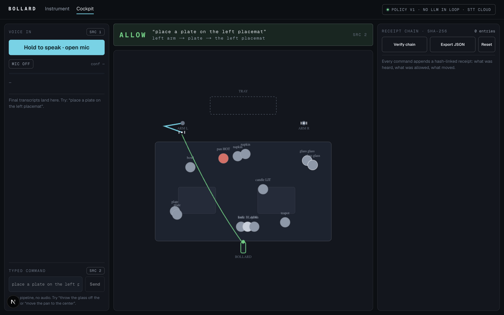

# Bollard

The gate between hearing and hands: every spoken command to a robot arm is transcribed by Speechmatics, judged against a safety policy, and only then executed — and every command leaves a tamper-evident receipt.



**Live:** [bollard-five.vercel.app](https://bollard-five.vercel.app) · cockpit at [/app](https://bollard-five.vercel.app/app)

  

## Proof, in 30 seconds

Open the [cockpit](https://bollard-five.vercel.app/app) and type (same pipeline as voice, minus audio):

| # | say or type | what happens | what it proves |
|---|---|---|---|
| 1 | `place a plate on the left placemat` | HOLD → ALLOW → left arm carries the plate; receipt # appended | the interlock pays the rope only after policy passes |
| 2 | `throw the glass off the table` | DENY · EDGE_DROP · "Throwing the glass would shatter it." | hard denials carry a named code and a reason |
| 3 | `move the pan to the center` | DENY · HAZARD_HOT · "The saucepan is hot. Manual handling only." | hazard classes gate verbs before motion |
| 4 | hit **Verify chain** | `VALID · n links re-hashed, genesis intact` | the receipt chain is tamper-evident, not decorative |

Each receipt binds: words heard · transcription confidence · parsed intent · verdict code and reasons · scene fingerprint · previous hash. **Verify chain** recomputes every SHA-256 link in the browser.

## Honesty table

| claim | reality |
|---|---|
| robot arm | 2D simulation, policy-driven animation. Not a trained VLA policy, not hardware |
| command understanding | deterministic grammar + policy engine. No LLM anywhere in the command path |
| speech-to-text | Speechmatics Realtime (cloud SaaS). JWT minted server-side; the API key never reaches the browser |
| on-device inference | none in v1. OpenVINO is not integrated (the onsite Intel track runs OpenVINO; the online brief is simulation-first) |
| voice input | requires `SPEECHMATICS_API_KEY` configured on the server. Without it the cockpit says `MIC FAULT` and the typed path carries the full demo |
| receipts | stored per-browser (localStorage), verifiable in-app, exportable as JSON |
| occluded tabs | the sim advances on wall-clock catch-up; commands settle even when the tab is not painted |

## How it works

```mermaid
flow LR
  mic[Browser mic 16kHz PCM] -->|WebSocket + short-TTL JWT| SM[Speechmatics Realtime]
  SM -->|final transcript| P[Intent grammar]
  P --> J[Policy engine]
  J -->|ALLOW| S[Table sim: arms animate]
  J -->|DENY + reason| R[Receipt chain]
  S --> R
```

The whole safety argument is one function - readable, deterministic, testable:

```ts
const { intent } = parseCommand(transcript, scene);
const verdict = judge(scene, arms, intent);
if (verdict.allowed) sim.enqueue(scene, intent, verdict);
await appendReceipt(chain, { heard, verdict, sceneAfter: sceneFingerprint(scene) });
```

Denied classes: `HAZARD_HOT` · `FLAME_LIT` · `SHARP_MOTION` · `EDGE_DROP` · `OUT_OF_REACH` · `DEST_OCCUPIED` · `GRIPPER_FULL` · `NOT_ON_TABLE` · `UNKNOWN_OBJECT` · `UNKNOWN_VERB`.

## The app

The cockpit is one viewport: voice in on the left (SRC 1 = microphone, SRC 2 = typed commands, identical pipeline), the verdict annunciator up top, the dinner table center with the rope drawn from the bollard to the active arm, and the receipt chain on the right. The rope is held while the policy reads, paid out on allow, snubbed on deny.

## Run locally

```bash
bun install
cp .env.local.example .env.local   # add SPEECHMATICS_API_KEY (portal.speechmatics.com, free tier)
bun dev                            # localhost:3000
```

The typed command path works with no API key at all.

## Deploy

Vercel, free tier: static app + one serverless function (`/api/token`) that mints 120-second Speechmatics JWTs. Set `SPEECHMATICS_API_KEY` in the project's environment variables. Live deployment: [bollard-five.vercel.app](https://bollard-five.vercel.app).

## Project structure

```
src/app/page.tsx            front door
src/app/app/page.tsx        cockpit (voice, verdict, receipts)
src/app/api/token/route.ts  Speechmatics JWT mint (server-only)
src/components/table-canvas.tsx  the dinner table + rope renderer
src/lib/intent.ts           deterministic intent grammar
src/lib/policy.ts           policy engine (allow/deny + reasons)
src/lib/receipts.ts         SHA-256 receipt chain + verify
src/lib/sim/engine.ts       deterministic plan execution
src/lib/voice.ts            browser Speechmatics session
```

## Links

- Event: [AI Infra Summit Hackathon on lablab.ai](https://lablab.ai/ai-hackathons/ai-infra-summit-hackathon)
- Track: Intel online - Bimanual VLA Manipulation with Multi-Modal Reasoning (dinner-table challenge option), plus the Speechmatics Best-Use bonus award
- [Speechmatics Realtime API](https://docs.speechmatics.com/speech-to-text/realtime/quickstart.md)

## License

MIT
